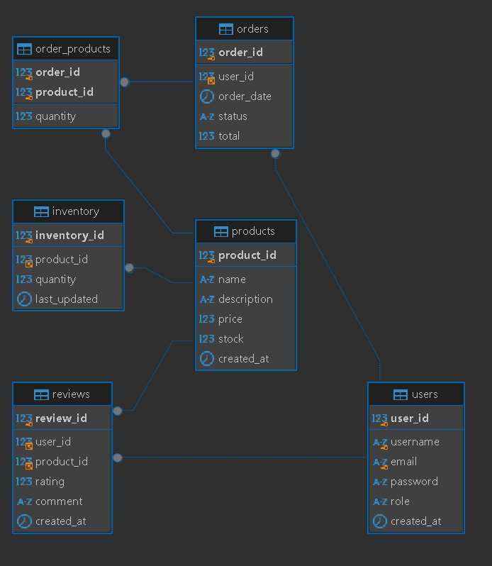

# 🐰 Bunny & Bloom Web App

## What this project is about
Bunny & Bloom is a **single-page web application (SPA)** built using **HTML, JavaScript, and MySQL**.

For **Milestone 1**, the focus was on **frontend development** and **database planning** (draft ERD). Later milestones will include full backend features, CRUD operations, and user authentication.

---

## What I did so far
- Created the **project structure** following the intended organization.  
- Built **static pages** for the app (no backend yet):  
  - **Register & Login**  
  - **Home, Menu, Blog, About, Profile**  
  - **Page for all entities**  
- Used **Bootstrap template** for a responsive and consistent design.  
- Each page is **separate HTML**, with JS and CSS included only once.  
- Planned the **database with 5 entities**:  
  - Users  
  - Products  
  - Orders  
  - Reviews  
  - Inventory  



---

## Project Structure
```
project-folder/
│
├─ frontend/ # Frontend (client-side)
│ ├─ index.html # Main HTML file (entry point)
│ ├─ assets/ # Static assets (images, fonts, icons)
│ │ ├─ css/ # Stylesheets (global & component-specific)
│ │ ├─ js/ # JavaScript files for interactivity
│ ├─ pages/ # Individual HTML/component files for pages
│ ├─ services/ # API calls and frontend service logic
│ └─ utils/ # Utility functions (formatting, validation)
│
├─ backend/ # Backend (server-side)
│ ├─ rest/ # REST API endpoints
│ │ ├─ routes/ # API routes
│ │ ├─ services/ # Business logic
│ │ └─ dao/ # Data Access Objects for database
│ ├─ index.php # Backend entry point
│ ├─ .htaccess # Server configuration & URL rewriting
│ ├─ vendor/ # Composer dependencies
│ ├─ composer.json # PHP dependencies & metadata
│ └─ composer.lock # Locked dependency versions
│
├─ .gitignore # Files/folders to ignore in version control
└─ README.md # Project documentation
```
---

## Next Steps
- Create the **database in MySQL**.  
- Connect **backend to frontend** with **FlightPHP and AJAX**.  
- Implement **CRUD operations** for all entities.  
- Add **authentication and role-based access**.
---

## Project Overview
Bunny & Bloom is a website for a coffee shop. This single-page web application (SPA) provides users with a clean, responsive interface to explore the café's offerings, services, and more.

## Pages and Features

### Homepage
- The first page of the website.
- Displays:
  - **Services**: What Bunny & Bloom offers.
  - **Reviews**: Customer feedback and testimonials.
  - **Location**: Map and address of the café.
- Includes a **button to navigate to the Menu** page.
- Other pages are accessible via the **navbar**.

### Blog
- Contains news and updates related to the café.

### About
- Provides a general explanation of the website and the café.

### User Pages
- **Login & Registration**: Allow users to sign in and create an account.
- **Profile**: A personal page for each user to view and manage their information.

### Admin Page
- Accessible only to admins.
- Manages **five entities**:  
  - Users  
  - Products  
  - Orders  
  - Reviews  
  - Inventory  

---
